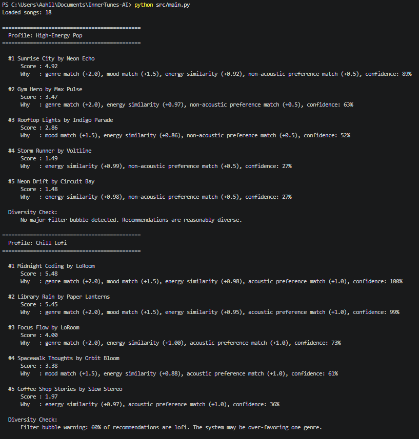
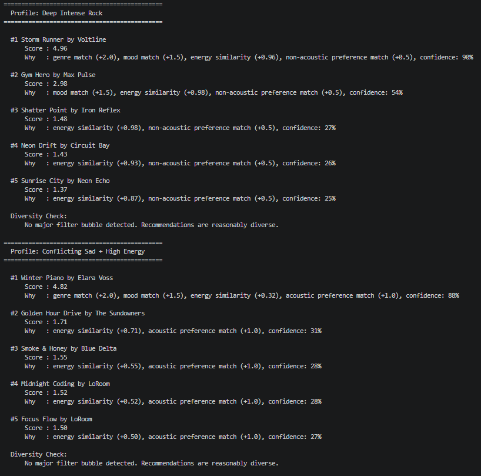
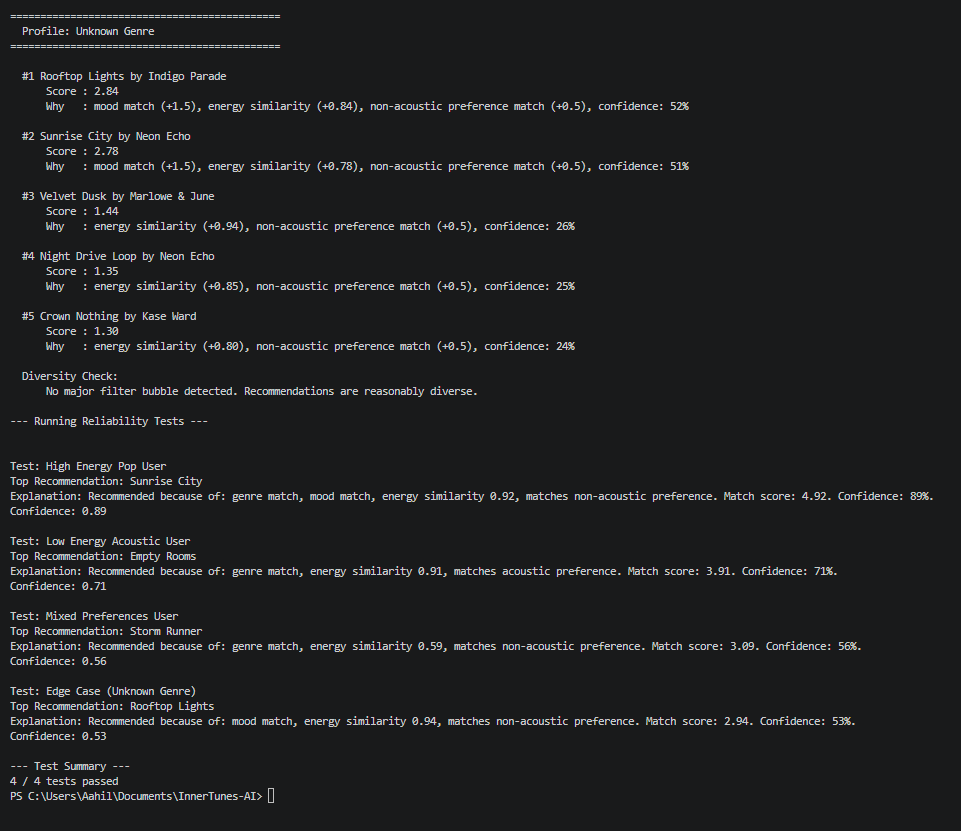

# 🎧 InnerTunes AI

**InnerTunes AI** is an explainable and reliability-focused music recommender system that generates personalized song suggestions based on user preferences. It uses structured features like genre, mood, and energy to rank songs, while also providing explanations, confidence scores, bias detection, and automated evaluation to ensure trustworthy recommendations.

This project extends the **Music Recommender Simulation** from Modules 1–3. The original system implemented a basic weighted scoring algorithm that recommended songs using features like genre, mood, and energy. While it demonstrated how data could be transformed into recommendations, it lacked explainability, bias awareness, and reliability testing. This version upgrades that system into a full applied AI system with evaluation and trust-focused features.

The system works as a pipeline where user input flows through multiple stages:

User Profile Input  
↓  
Song Dataset (songs.csv)  
↓  
Scoring Engine (genre, mood, energy, acoustic)  
↓  
Ranking System (top-K recommendations)  
↓  
Explanation Generator (why each song was chosen)  
↓  
Confidence Scoring (how strong the match is)  
↓  
Bias Detection (filter bubble check)  
↓  
Final Recommendations Output  
↓  
Evaluation System (automated tests + reliability checks)

To run the project:

1. Clone the repository  
git clone https://github.com/YOUR_USERNAME/InnerTunes-AI.git  
cd InnerTunes-AI  

2. Install dependencies  
pip install -r requirements.txt  

3. Run the program  
python src/main.py  

4. Run tests  
pytest  

Example outputs:

High-Energy Pop User:
#1 Sunrise City by Neon Echo  
Score : 4.92  
Why   : genre match, mood match, energy similarity, non-acoustic preference  
Confidence: 89%  

Chill Lofi User:
#1 Midnight Coding by LoRoom  
Score : 5.48  
Why   : genre match, mood match, energy similarity, acoustic preference match  
Confidence: 100%  

Bias detection example:
Filter bubble warning: 60% of recommendations are lofi.

Design decisions:
A rule-based scoring system was used instead of machine learning for simplicity and interpretability. Confidence scoring was added to quantify how strong each recommendation is. Bias detection helps identify when the system over-recommends a single genre. An automated evaluation system was added to test the system instead of assuming it works.

Trade-offs:
The system is simpler than real-world machine learning recommenders like Spotify and has limited personalization due to the small dataset. However, it is more transparent, explainable, and easier to evaluate.

Testing summary:
The system includes an automated evaluator that tests multiple user profiles, including high-energy users, acoustic preference users, mixed preferences, and edge cases like unknown genres. All test cases returned valid recommendations, confidence scores aligned with match strength, and the system handled edge cases without failure. Bias detection successfully identified when recommendations became too concentrated in one genre. Some edge cases resulted in lower confidence scores, and the limited dataset reduces diversity.

Reliability Results:
All 4 test cases passed successfully. The system handled normal, mixed, and edge-case user profiles without failure. Confidence scores ranged from moderate to high depending on how well the song matched the user preferences. Lower confidence scores appeared in edge cases (such as unknown genres), showing that the system correctly reflects uncertainty when recommendations are weaker.

Reflection and Ethics:

One limitation of this system is that it relies on a small and biased dataset of only 18 songs. This means users whose preferences are not well represented (such as niche genres) may receive weaker or less accurate recommendations. Additionally, the scoring system prioritizes genre heavily, which can lead to filter bubbles where similar types of songs are repeatedly recommended.

This system could be misused by reinforcing narrow listening habits or limiting exposure to diverse music. For example, constantly recommending only one genre could prevent users from discovering new styles. To prevent this, the system includes a filter bubble detection feature that warns when recommendations become too concentrated in one genre. Future improvements could include intentionally adding diversity into recommendations.

One surprising result during testing was how the system still produced reasonable recommendations even for edge cases, such as unknown genres. However, the confidence scores were lower in those situations, which showed that the system was correctly identifying uncertainty rather than pretending to be confident.

During development, AI tools were helpful for structuring the system and improving code organization. One helpful suggestion was adding a reliability testing module, which made the system more complete and aligned with real-world AI practices. However, one flawed suggestion was initially placing evaluation code outside of the main execution flow, which caused errors. This required debugging and reinforced the importance of understanding how code executes rather than blindly trusting AI-generated solutions.

Key takeaways:
AI systems should be explainable and interpretable. Confidence scoring improves trust. Bias detection is important in recommendation systems. Reliability testing is essential for building trustworthy AI systems.

Demo Walkthrough:

1. Running the system and generating recommendations

2. Example outputs showing explanations and confidence scores across different user profiles

3. Edge case handling and reliability testing results (4/4 tests passed)
